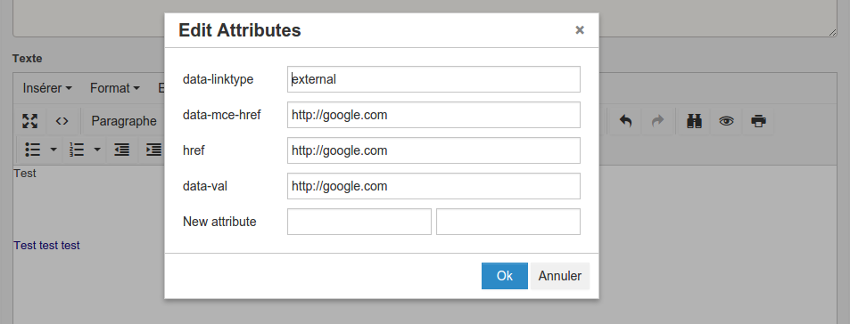

# tinymce-editattributes
A plugin allowing edition and addition of attributes for TinyMCE 4

How to install the plugin
=========================

1. copy `editattributes` folder to the tinymce `plugins` folder.

2. set up your instance in the tinyMCE.init method to use the plugin, like::

  plugins : "... editattributes ..."

3. set up your instance to use the button, for example::

  toolbar : "... | editattributes"
